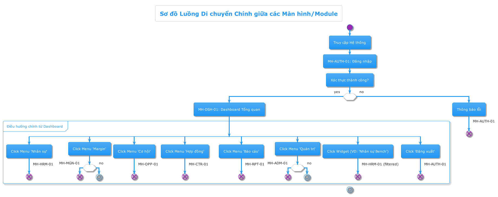
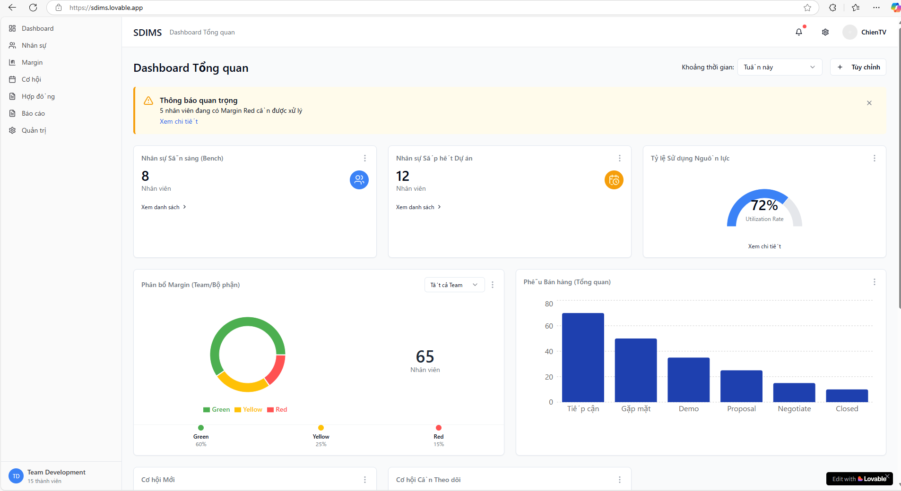
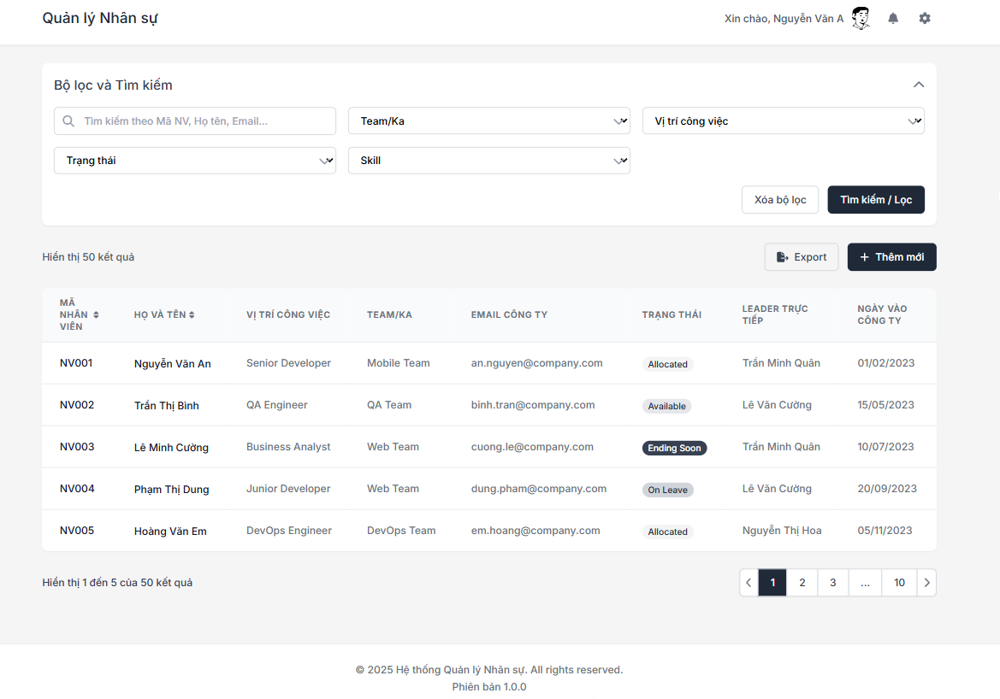
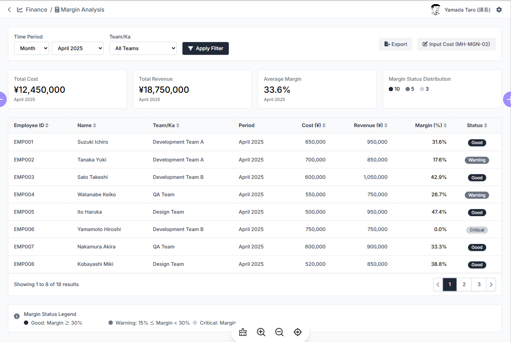
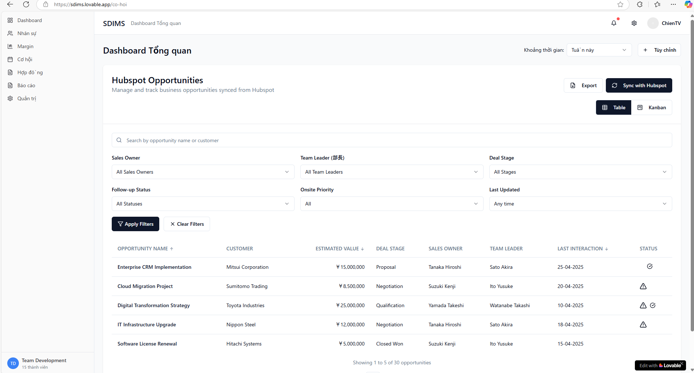

# Hệ thống Quản lý Nội bộ (Internal Management System)

**Tài liệu:** Thiết kế Sơ bộ Màn hình và Luồng Chức năng

**Version Control:**

| Version | Date       | Author      | Changes                                            | Approved By | Status    |
| :------ | :--------- | :---------- | :------------------------------------------------- | :---------- | :-------- |
| 1.0     | 2025-04-28 | Chien Tran Van | Initial draft of screens and basic flow            |- | Draft     |

---

## 1. Danh sách Màn hình Dự kiến

Dưới đây là danh sách các màn hình chính dự kiến cho từng module, dựa trên các yêu cầu chức năng đã xác định.

| ID Màn hình | Tên Màn hình                                 | Module Liên quan                   | Mô tả Chức năng Chính                                                                                               | Link to Diagram                      |
| :---------- | :------------------------------------------- | :--------------------------------- | :------------------------------------------------------------------------------------------------------------------ | :----------------------------------- |
| **MH-AUTH-01** | Đăng nhập                                    | Xác thực                           | Cho phép người dùng nhập tên đăng nhập và mật khẩu để truy cập hệ thống.                                            | [View Diagram](./diagram/MH-AUTH-01.puml) |
| **MH-DSH-01** | Dashboard Tổng quan                          | Dashboard                          | Hiển thị các widget tổng hợp thông tin quan trọng (Nhân sự Bench, Cơ hội mới, Margin, Doanh thu...). Điều hướng chính. | [View Diagram](./diagram/MH-DSH-01.puml) |
| **MH-HRM-01** | Danh sách Nhân sự                          | Quản lý Nhân sự (HRM)             | Hiển thị danh sách nhân viên dạng bảng, tìm kiếm, lọc, nút Thêm mới, Export.                                       | [View Diagram](./diagram/MH-HRM-01.puml) |
| **MH-HRM-02** | Chi tiết Nhân sự                           | Quản lý Nhân sự (HRM)             | Xem thông tin chi tiết của một nhân viên (cơ bản, skills, trạng thái, lịch sử dự án). Nút Sửa.                      | [View Diagram](./diagram/MH-HRM-02.puml) |
| **MH-HRM-03** | Form Thêm/Sửa Nhân sự                       | Quản lý Nhân sự (HRM)             | Form để nhập/chỉnh sửa thông tin nhân viên, quản lý skills, cập nhật trạng thái, phân bổ dự án.                    | [View Diagram](./diagram/MH-HRM-03.puml) |
| **MH-HRM-04** | (Admin) Quản lý Danh mục Skills            | Quản lý Nhân sự (HRM) / Admin    | Admin/Leader quản lý (CRUD) danh mục các kỹ năng được sử dụng trong hệ thống.                                      | [View Diagram](./diagram/MH-HRM-04.puml) |
| **MH-MGN-01** | Bảng Margin Nhân sự                        | Quản lý Hiệu suất & Margin        | (Leader/TP) Hiển thị danh sách nhân viên, cost, revenue, margin, cảnh báo màu. Lọc theo team, thời gian.             | [View Diagram](./diagram/MH-MGN-01.puml) |
| **MH-MGN-02** | Form Nhập/Import Chi phí                   | Quản lý Hiệu suất & Margin        | (Leader/TP) Giao diện nhập chi phí thủ công hoặc upload file (CSV/Excel) theo tháng.  <mark> **Đề xuất:** Có thể sử dụng automation tự động update hàng tháng dựa theo hợp đồng và dự án hiện tại của nhân viên                               | [View Diagram](./diagram/MH-MGN-02.puml) |
| **MH-OPP-01** | Danh sách Cơ hội Kinh doanh                 | Quản lý Cơ hội Kinh doanh         | Hiển thị danh sách cơ hội (đồng bộ từ Hubspot), trạng thái follow-up, người phụ trách. Tìm kiếm, lọc.             | [View Diagram](./diagram/MH-OPP-01.puml) |
| **MH-OPP-02** | Chi tiết Cơ hội Kinh doanh                 | Quản lý Cơ hội Kinh doanh         | Xem thông tin chi tiết cơ hội, lịch sử tương tác, thêm ghi chú, assign Leader, đánh dấu ưu tiên Onsite.             | [View Diagram](./diagram/MH-OPP-02.puml) |
| **MH-CTR-01** | Danh sách Hợp đồng                         | Quản lý Hợp đồng & Doanh thu      | Hiển thị danh sách hợp đồng dạng bảng. Tìm kiếm, lọc, nút Thêm mới.                                                | [View Diagram](./diagram/MH-CTR-01.puml) |
| **MH-CTR-02** | Chi tiết Hợp đồng                          | Quản lý Hợp đồng & Doanh thu      | Xem thông tin chi tiết HĐ, điều khoản thanh toán, trạng thái thu tiền, liên kết, file đính kèm. Nút Sửa.          | [View Diagram](./diagram/MH-CTR-02.puml) |
| **MH-CTR-03** | Form Thêm/Sửa Hợp đồng                      | Quản lý Hợp đồng & Doanh thu      | Form để nhập/chỉnh sửa thông tin hợp đồng, điều khoản thanh toán, liên kết nhân sự/cơ hội.                         | [View Diagram](./diagram/MH-CTR-03.puml) |
| **MH-CTR-04** | (Kế toán) Cập nhật Trạng thái Thu tiền      | Quản lý Hợp đồng & Doanh thu      | Giao diện (hoặc chức năng Import) cho Kế toán cập nhật trạng thái thu tiền của các đợt thanh toán.                | [View Diagram](./diagram/MH-CTR-04.puml) |
| **MH-CTR-05** | (Admin) Quản lý KPI Doanh thu Sales        | Quản lý Hợp đồng & Doanh thu / Admin | Admin/Quản lý thiết lập, xem, sửa KPI doanh thu cho từng nhân viên Sales theo kỳ.                                  | [View Diagram](./diagram/MH-CTR-05.puml) |
| **MH-RPT-01** | Danh sách Báo cáo                          | Dashboard & Báo cáo              | Liệt kê các loại báo cáo có sẵn trong hệ thống.                                                                   | [View Diagram](./diagram/MH-RPT-01.puml) |
| **MH-RPT-02** | Xem Báo cáo Chi tiết                       | Dashboard & Báo cáo              | Hiển thị dữ liệu báo cáo dưới dạng bảng, có bộ lọc tùy chọn và chức năng Export.                                    | [View Diagram](./diagram/MH-RPT-02.puml) |
| **MH-ADM-01** | (Admin) Quản lý Người dùng                  | Quản trị Hệ thống                  | Admin quản lý tài khoản người dùng (Thêm, Sửa, Khóa/Mở khóa, Reset mật khẩu...).                                   | [View Diagram](./diagram/MH-ADM-01.puml) |
| **MH-ADM-02** | (Admin) Quản lý Vai trò & Phân quyền       | Quản trị Hệ thống                  | Admin định nghĩa các vai trò và gán quyền truy cập chức năng/dữ liệu cho từng vai trò.                              | [View Diagram](./diagram/MH-ADM-02.puml) |
| **MH-ADM-03** | (Admin) Cấu hình Hệ thống                  | Quản trị Hệ thống                  | Admin cấu hình các tham số chung: danh mục, ngưỡng cảnh báo, cài đặt API Hubspot...                               | [View Diagram](./diagram/MH-ADM-03.puml) |
| **MH-ADM-04** | (Admin) Xem Log Hệ thống                    | Quản trị Hệ thống                  | Admin xem lại lịch sử hoạt động và các lỗi phát sinh trong hệ thống.                                               | [View Diagram](./diagram/MH-ADM-04.puml) |

## 2. Luồng Di chuyển Chính (High-Level Flow)

Sơ đồ dưới đây mô tả luồng điều hướng chính giữa các màn hình/module. Chi tiết luồng bên trong từng màn hình được mô tả trong các file `.puml` riêng tại thư mục `diagram`.

## 3. Màn hình Demo (Ví dụ)

### MH-DSH-01: Dashboard Tổng quan

### MH-HRM-01: Danh sách Nhân sự

### MH-MGN-01: Bảng Margin Nhân sự

### MH-OPP-01: Danh sách Cơ hội Kinh doanh

