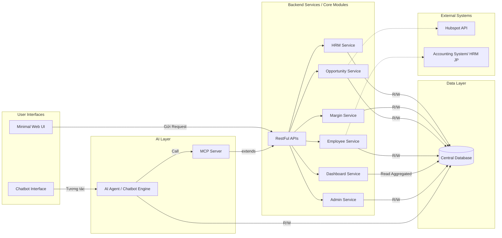

## Proposal: Xây dựng Hệ thống Tool Quản lý Nội bộ Tích hợp AI Agent

**1. Tổng quan:**

**Mục tiêu:** Xây dựng một hệ thống quản lý nội bộ toàn diện phục vụ cho SD Teams. 
**Point:**    Điểm nhấn của kiến trúc này là việc tích hợp sâu một **AI Agent (dưới dạng Chatbot)** làm giao diện tương tác chính cho nhiều chức năng, đặc biệt trong Module Quản lý Nhân sự (HRM), nhằm:

*   **Giảm thiểu** đáng kể việc phải xây dựng các màn hình UI phức tạp cho các tác vụ quản lý nhân sự thông thường.
*   **Tăng tốc độ** truy vấn và cập nhật thông tin cho người dùng thông qua giao diện hội thoại tự nhiên.
*   **Mở đường** cho các khả năng tự động hóa và phân tích thông minh khác trong tương lai.

**2. Kiến trúc Hệ thống Đề xuất (Theo sơ đồ hiện tại):**

Hệ thống sẽ bao gồm các thành phần chính sau:

*   **Core Modules Backend:** Các module chức năng (HRM, Margin, Opportunity, Employee, Dashboard, Admin) là các service độc lập, chịu trách nhiệm logic nghiệp vụ và quản lý dữ liệu.
*   **Central Database:** Lưu trữ dữ liệu tập trung cho các Core Modules Backend và data cho Chat Bot.
*   **RESTful APIs:** Đóng vai trò là một lớp giao diện chung cho các Core Modules Backend. `Minimalist Web UI` gửi request đến lớp API này để tương tác với hệ thống.
*   **AI Layer:** Bao gồm:
    *   `AI Agent (Chatbot Engine)`: Thành phần xử lý ngôn ngữ tự nhiên, tương tác với người dùng qua `Chatbot Interface`. Agent này thực hiện tác vụ bằng cách gọi đến `MCP Server` và **đọc/ghi trực tiếp** vào `Central Database`.
    *   `MCP Server`: Một service riêng biệt được `AI Agent` gọi đến, và dường như service này sử dụng hoặc mở rộng (`extends`) chức năng từ lớp `RESTful APIs`.
*   **Minimalist Web UI:** Giao diện web cho người dùng (hiển thị Dashboard, form phức tạp, cấu hình), tương tác chủ yếu thông qua lớp `RESTful APIs`.
*   **User Interfaces:** Bao gồm `Chatbot Interface` (giao diện chat) và `Minimalist Web UI` (giao diện web).
*   **External Systems:** Các hệ thống bên ngoài như `Hubspot API` và `Accounting System` tương tác với các Core Modules Backend tương ứng.

**3. Tích hợp AI và Tự động hóa theo Module:**

*   **Module 1: Quản lý Nhân sự (HRM) - Trọng tâm AI Agent:** - <mark>*(Khả Thi)*
    *   **Thay thế UI bằng Chatbot:** Các chức năng chính sẽ được thực hiện qua Chatbot:
        *   **Truy vấn thông tin (1.1, 1.2, 1.3):**
            *   "Xem hồ sơ của nhân viên X."
            *   "Tìm các Lập trình viên Java có trên 3 năm kinh nghiệm và biết Spring Boot." (`Tìm kiếm nhân sự theo tổ hợp skills... (*)`)
            *   "Ai đang rảnh (bench) trong team Y?" (`Xem nhanh danh sách nhân sự đang Bench...`)
            *   "Nhân viên nào sắp hết dự án vào tháng tới?" (`Cảnh báo khi có nhân sự sắp hết dự án.`)
            *   "Xem lịch sử dự án của nhân viên Z." (`Xem lịch sử dự án...`)
            <mark> => Giảm thiểu được thao tác trên UI cho user.

        *   **Cập nhật thông tin (1.2, 1.3):**
            *   NV: "Thêm kỹ năng Python, 2 năm kinh nghiệm, mức độ Intermediate vào hồ sơ của tôi." (`Nhân viên tự cập nhật profile skill...`)
            *   Leader: "Phân bổ nhân viên A vào dự án B, 100%, từ ngày dd/mm/yyyy." (`Leader/Quản lý cập nhật trạng thái...`)
            *   Leader: "Cập nhật trạng thái của nhân viên C thành 'Ending Soon', dự kiến kết thúc ngày dd/mm/yyyy."
        *   **Đề xuất thông minh (1.2):**
            *   Leader: "Gợi ý 3 nhân viên phù hợp nhất cho dự án cần kỹ năng [skill A], [skill B]." (`Gợi ý nhân sự phù hợp... (*)`)
    *   **Giảm thiểu UI:** Chỉ cần UI cho việc xem danh sách tổng quan (nếu cần thiết), nhập liệu ban đầu/import, và quản lý danh mục skills. Việc CRUD thông tin cơ bản (1.1) có thể thực hiện qua form đơn giản hoặc chat có hướng dẫn.
     

*   **Module 2: Quản lý Hiệu suất & Margin:**
    *   **Tự động hóa:** Tính toán Margin (`Tính toán Margin...`), tổng hợp theo team/bộ phận (`Tổng hợp margin...`) là tự động. Cảnh báo màu sắc (`Tự động hiển thị màu sắc cảnh báo...`).
 
*   **Module 3: Quản lý Cơ hội Kinh doanh:**
    *   **Tự động hóa:** Đồng bộ từ Hubspot (`Lập lịch... đồng bộ...`), tính toán trạng thái Follow-up dựa trên ngày tương tác cuối.

    *   **Chatbot Interface:**
        *   "Liệt kê các cơ hội đang ở giai đoạn 'Demo' cho khách hàng X."
        *   "Assign Leader Y vào cơ hội Z."
        *   "Thêm ghi chú vào cơ hội T: 'Đã gửi báo giá, chờ phản hồi'."
 
*   **Module 4: Quản lý Hợp đồng & Doanh thu:**
    *   **Tự động hóa:** Cảnh báo thanh toán đến hạn/quá hạn (`Tự động cảnh báo...`), Tổng hợp doanh thu thực tế so với KPI (`Tự động tổng hợp doanh thu...`).
    *   **AI Nâng cao:** <mark> (Cần điều tra thêm)
        *   **Dự báo dòng tiền:** AI dự báo khả năng thu tiền dựa trên lịch sử thanh toán của khách hàng và điều khoản hợp đồng.
    *   **Chatbot Interface:**
        *   "Hợp đồng nào sẽ hết hạn trong 3 tháng tới?"
        *   "Kiểm tra trạng thái thanh toán của hợp đồng HĐ-123."
 

*   **Module 5: Dashboard & Báo cáo:**
    *   **Giao diện chính:** Dashboard tổng hợp vẫn nên có trên Web UI, nhưng Chatbot là kênh mạnh mẽ để truy vấn chi tiết hoặc ad-hoc.
 

*   **Module 6: Quản trị Hệ thống:**
    *   **Tự động hóa/AI:** Ít tiềm năng hơn, chủ yếu là UI truyền thống. Có thể dùng AI để gợi ý phân quyền dựa trên vai trò.
    *   **Chatbot Query:** "Kiểm tra log lỗi của hệ thống hôm qua." (`Xem log hệ thống.`)

## Đề xuất Hạ tầng & Công nghệ

Dưới đây là đề xuất về các công nghệ và hạ tầng có thể sử dụng, được chia thành 2 tùy chọn chính để đáp ứng các mức độ ưu tiên khác nhau về quản lý, chi phí và khả năng mở rộng.

| Category         | Technology/Component | Option 1: Cloud-Native Focus (Ưu tiên Managed Services) | Option 2: Flexible/Hybrid Focus (Linh hoạt hơn) | Ghi chú/Lý do lựa chọn                                                                                                  |
| :--------------- | :------------------- | :------------------------------------------------------- | :---------------------------------------------------- | :---------------------------------------------------------------------------------------------------------------------- |
| **Backend**      | Ngôn ngữ/Framework   | Java (Spring Boot 3.x+)                                  | Java (Spring Boot 3.x+)                               | Phổ biến, hệ sinh thái mạnh mẽ, cộng đồng lớn, phù hợp microservices, hỗ trợ tốt các tính năng mới.                     |
|                  | Kiểu kiến trúc      | Microservices                                            | Microservices                                         | Phù hợp với các module độc lập đã định nghĩa, dễ dàng mở rộng và phát triển từng phần.                                   |
|                  | Containerization    | Docker                                                   | Docker                                                | Tiêu chuẩn công nghiệp để đóng gói và triển khai ứng dụng nhất quán.                                                   |
| **Frontend**     | Web UI Framework    | React                                           | React                                        | Framework hiện đại, hiệu năng tốt, cộng đồng lớn, phù hợp xây dựng UI tối giản và tương tác. AI hỗ trợ mạnh.                      |
|                  | Chatbot UI          | Tích hợp vào trang chính hoặc Tích hợp vào `Teams` (Chanel SD, Personals,..)           | |
| **Database**     | Relational DB (*1)       | PostgreSQL (Managed: AWS RDS)     | PostgreSQL (Self-hosted)                 | Mạnh mẽ, mã nguồn mở, hỗ trợ tốt kiểu dữ liệu JSONB, phù hợp lưu trữ dữ liệu có cấu trúc (nhân sự, hợp đồng, etc.). |
|                  | Vector Database (AI)| Managed Vector DB (Pinecone, AWS OpenSearch Serverless, ...) | Tích hợp vào DB hệ thống (*1)  | Cần thiết để lưu trữ và truy vấn vector embeddings cho AI Agent (tìm kiếm ngữ nghĩa, RAG - Retrieval-Augmented Generation). <mark>Có thể Sử dụng chung với DB chính <mark>|
| **AI Layer**     | Hosting   | N8N. Deploy nhanh, có thể tích hợp thêm các Workflow Automation         | Self-Host. Tự tạo ra các module sử dụng AI      | Build các Agent tích hợp các model AI cho Chat Bot|
|                  | LLM Model           | API-based (OpenAI GPT-4/4o, Google Gemini) |  |          |
|                  | MCP Server | Hosting trên cùng `N8N` |Tự build riêng một MCP Server riêng, extends từ API| **Options 1:** Tích hợp nhanh thực hiện tạo nhanh -> Dễ maitain, tạo sửa xóa khi thêm tính năng (Trục tiếp trên UI).  **Options 2:** Cần effort để thực thi, và maintan khó hơn Options 1. Tuy nhiên, tính tùy chỉnh cao hơn                |
| **Deployment/Infra** | Orchestration     | Managed Kubernetes (AWS EKS)           | Managed Kubernetes hoặc Self-hosted (K3s, Kubeadm) / Docker Swarm | Kubernetes là tiêu chuẩn điều phối container. Managed đơn giản hóa quản lý. K3s/Swarm nhẹ hơn cho self-host.          |
|                  | CI/CD               | GitHub Actions (AWS CodePipeline) | GitHub Actions / GitLab CI / Jenkins                    | Tự động hóa quy trình build, kiểm thử và triển khai ứng dụng.                                                        |
|                  | Monitoring/Logging  | Managed Services (CloudWatch) | Self-hosted | Theo dõi hiệu năng, sức khỏe hệ thống và thu thập log tập trung để gỡ lỗi và phân tích.                                 |
|                  | Cloud Provider      | AWS       | Bất kỳ / On-premise / Hybrid                          | Option 1 tận dụng hệ sinh thái tích hợp của một cloud. Option 2 linh hoạt hơn trong việc lựa chọn/kết hợp môi trường. |

**Giải thích lựa chọn:**

*   **Java (Spring Boot):** Là lựa chọn vững chắc cho backend với kinh nghiệm và hệ sinh thái sẵn có.
*   **Microservices:** Phù hợp với bản chất module hóa của ứng dụng, tạo điều kiện cho việc phát triển và scale độc lập.
*   **React:** Các framework frontend phổ biến, hiện đại.
*   **PostgreSQL:** Cơ sở dữ liệu quan hệ mạnh mẽ, linh hoạt. Việc có thêm `Vector Database` (hoặc extension như pgvector) là **quan trọng** cho các tính năng tìm kiếm ngữ nghĩa và RAG của AI Agent.
*   **N8N** : Nền tảng Lowcode, giúp deploy nhanh tạo chat Bot, hỗ trợ tạo MCP server, tối ưu các workflow bằng automation.
*   **API-based LLM:** Cung cấp hiệu năng và khả năng tốt nhất hiện nay.
    * Open AI gpt-4o : LLM Model giúp tạo khả năng phân tích và đưa ra quyết định
    * Open AI embeding: Chuyển đổi các tài liệu sang `vector DB` phục vụ cho truy vấn.
*   **Containerization (Docker) & Orchestration (Kubernetes):** Là tiêu chuẩn hiện đại cho việc đóng gói, triển khai và quản lý ứng dụng quy mô lớn, đặc biệt là microservices.
*   **Managed Services (Option 1):** Giảm đáng kể công sức quản lý hạ tầng (database, Kubernetes cluster, monitoring), cho phép đội ngũ tập trung vào phát triển tính năng. Phù hợp nếu ưu tiên tốc độ ra mắt và giảm gánh nặng vận hành.
*   **Flexible/Hybrid (Option 2):** Cung cấp nhiều lựa chọn hơn về chi phí và kiểm soát hạ tầng. Phù hợp nếu đã có hạ tầng on-premise, muốn tối ưu chi phí, hoặc yêu cầu tùy chỉnh sâu về hạ tầng. Đòi hỏi nhiều nỗ lực vận hành hơn.

**5. Lợi ích của Kiến trúc này:**

*   **Giảm chi phí và thời gian phát triển UI:** Loại bỏ nhu cầu xây dựng nhiều màn hình phức tạp, đặc biệt cho HRM.
*   **Trải nghiệm người dùng hiện đại:** Giao diện hội thoại nhanh chóng, tiện lợi cho nhiều tác vụ.
*   **Tăng hiệu quả:** Tự động hóa nhiều quy trình, truy vấn thông tin nhanh hơn.
*   **Khả năng phân tích nâng cao:** AI có thể cung cấp các insight sâu sắc hơn từ dữ liệu.
*   **Linh hoạt và Mở rộng:** Kiến trúc services và API giúp dễ dàng bảo trì và thêm chức năng mới.

**6. Lưu ý và Thách thức:**

*   **Phát triển AI Agent:** Xây dựng chatbot, và tích hợp API.
*   **Độ chính xác và Tin cậy:** AI Agent cần được huấn luyện và kiểm thử kỹ lưỡng để đảm bảo hiểu đúng yêu cầu và trả về thông tin chính xác.
*   **Phân quyền:** Đảm bảo AI Agent tuân thủ nghiêm ngặt quyền truy cập dữ liệu của từng người dùng.
*   **Giới hạn của Chatbot:** Không phải tất cả các tác vụ đều phù hợp với giao diện chat (ví dụ: xem biểu đồ phức tạp, nhập liệu hàng loạt). Cần xác định rõ phạm vi của Chatbot và những gì vẫn cần UI truyền thống.
*   **Quản lý dữ liệu:** Chất lượng dữ liệu đầu vào là yếu tố then chốt cho cả hệ thống và AI Agent.

## 7. Ước tính Dịch vụ AWS và Chi phí Hàng tháng (Option 1)

**AWS Cost**: $68/Tháng
[Estimate](/05460cf0-f073-4dfa-9a10-59d20c5b3814.pdf)   [Link-edit](https://calculator.aws/#/estimate?id=70148c7c15bd90f923556a1d7cec4f7b91ff474c)

